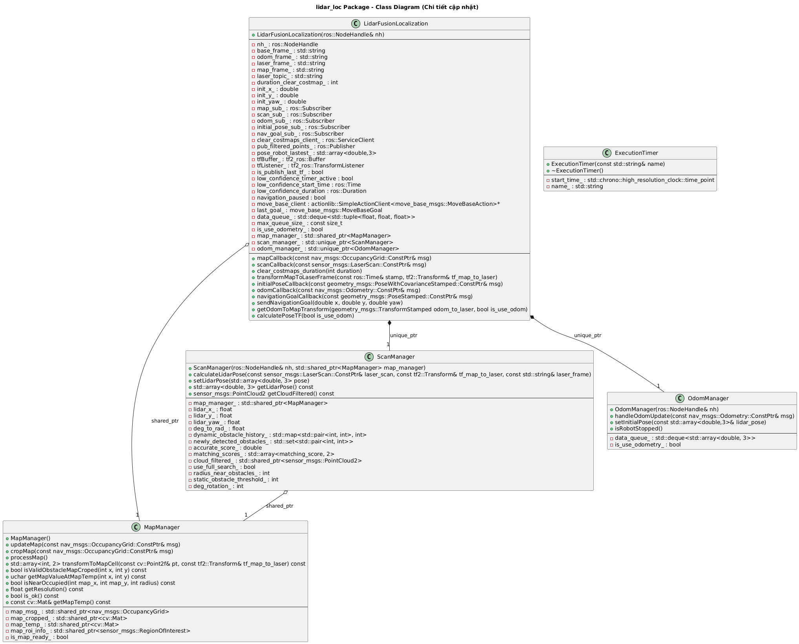

# LIDAR Localization for TIAR Robot


[](https://www.gnu.org/licenses/old-licenses/gpl-2.0.en.html)


## Appendix

This package provides a 2D Lidar-based localization solution for ROS (`devel-noetic`), using scan matching and occupancy grid maps. It is designed for mobile robots in indoor or structured environments and integrates with the ROS navigation stack (`move_base`). The system supports dynamic obstacle filtering, real-time pose estimation, and is compatible with both simulation (e.g., TurtleBot3 in Gazebo) and real robots.

## Acknowledgements

- Utilized the **OpenCV** library for map processing tasks  
- Inspired by the project: [jie_ware](https://github.com/6-robot/jie_ware)


## Features

- **Lidar scan matching**: Estimates the robot's pose by aligning incoming laser scans with a static occupancy grid map.
- **Dynamic obstacle filtering**: Removes points corresponding to dynamic obstacles using scan history and map correlation.
- **Efficient map cropping**: Crops the occupancy grid map to a region of interest for faster scan matching.
- **Odometry integration**: Fuses odometry data with scan matching for robust localization.
- **TF broadcasting**: Publishes the robot's pose to the ROS TF tree for use by other nodes (e.g., move_base).
- **Automatic costmap clearing**: Clears the navigation costmap if the robot is stationary for a configurable duration.
- **Logging and timing utilities**: Provides debug output and timing information for performance analysis.
- **Visualization**: Publishes filtered scan points as `sensor_msgs/PointCloud2` for RViz.
## Architecture
Main Components
- LidarFusionLocalization: Main node, manages ROS interfaces, data flow, and localization logic.
- MapManager: Handles map data, cropping, and creation of soft occupancy maps for scan matching.
- ScanManager: Performs scan matching, dynamic obstacle filtering, and pose optimization.
- OdomManager: Manages odometry data and robot motion status.
- ExecutionTimer: Utility for profiling code execution time.
Class Diagram

## 🛠️Installation

1️⃣ **Clone the repository:**

```bash 
cd ~/catkin_ws/src/ 
git clone 
```
2️⃣ **Install dependencies** (if not already installed):
```bash
sudo apt-get install ros-noetic-navigation ros-noetic-tf2-ros ros-noetic-geometry-msgs ros-noetic-sensor-msgs ros-noetic-nav-msgs ros-noetic-actionlib ros-noetic-move-base-msgs libopencv-dev
```
3️⃣ **Build code**:
```bash 
cd ~/catkin_ws
catkin_make
source devel/setup.bash
```
## 🚀Deployment

1️⃣ Edit the lidar_loc.launch file
- Configure the correct frame IDs and topics.
- Update the launch file with your initial pose and parameters:
```bash
<launch>
    <param name="init_pose_x" value="-3.0" />
    <param name="init_pose_y" value="1.0" />
    <param name="init_pose_yaw" value="0.0" />
    
    <param name="duration_clear_costmap" value="3" />
    <param name="base_frame" value="base_footprint" />
    <param name="map_frame" value="map" />
    <param name="laser_frame" value="base_scan" />
    <param name="odom_frame" value="odom" />

    <param name="map_topic" value="map" />
    <param name="laser_topic" value="scan" />
    <param name="odom_topic" value="odom" />
    <param name="initial_pose_topic" value="initialpose" />
    <param name="filtered_scan_topic" value="filtered_scan_points" />
    <param name="move_base_goal_topic" value="move_base_simple/goal" />
    <param name="move_base_action_name" value="move_base" />
    <param name="move_base_clear_costmaps_service_name" value="move_base/clear_costmaps" />

    <param name="use_full_search" value="false" />
    <param name="radius_near_obstacles" value="2" />
    <param name="static_obstacle_threshold" value="5" />
    <param name="deg_rotation" value="4" />

    <node name="lidar_loc_node" pkg="lidar_loc" type="lidar_loc_node" output="screen" />
</launch>
```
**Parameters Overview**
+ `init_pose_x`, `init_pose_y`, `init_pose_yaw`: Initial pose of the robot in the map (position and orientation).

- `use_full_search`: (default: `false`).

- `radius_near_obstacles`: (default: `2`) Radius (in pixels) around each scan point used to determine whether a detected object overlaps with the static map. If no match is found within this radius, the object may be considered dynamic.

- `static_obstacle_threshold`: (default: `5`) Threshold to determine if a newly detected obstacle should be considered part of the static environment. If a point appears at the same location at least 5 times, it is treated as a new static obstacle and filtered out to improve localization accuracy.

- `deg_rotation`: (default: `4`) Yaw search range used during global scan matching. For example, deg_rotation: 4 means the system searches from -4° to +4° around the current estimate with 1° resolution. This parameter only takes effect when `use_full_search` is `true`

- `duration_clear_costmap`: (default: `3 seconds`) clear cost map when robot stopped after 3 seconds.

2️⃣ Launch the package
- Run the node using:
```bash
roslaunch lidar_loc lidar_loc.launch 
```
**Note:** Integrate with other ROS nodes** such as `map_server`, `move_base`, and `robot_state_publisher` as needed.

## 📽️ Demo Video

Demo of `lidar_loc` for 2D LiDAR-based localization using **TurtleBot3**, **Gazebo**, and **RViz** in **ROS1 Noetic**.

[](https://www.youtube.com/watch?v=OZAix0l_Q6k)

## ✅Running Tests
Manual testing is performed using RViz and Gazebo simulation.
Ensure all frame names are consistent with your robot's TF tree.
The map must be available and valid before localization can start.
For best results, tune the scan matching parameters and gradient mask size according to your environment and LiDAR characteristics.

You can verify pose estimation and scan matching by visualizing /filtered_scan_points and the TF frames.

1️⃣ **Modify the turtlebot3_navigation.launch file**
- Update the launch file to replace AMCL with your custom lidar_loc node.
```bash
<launch>
  <!-- Arguments -->
  <param name="use_sim_time" value="true" />
  <arg name="model" default="$(env TURTLEBOT3_MODEL)" doc="model type [burger, waffle, waffle_pi]"/>
  <arg name="map_file" default="$(find turtlebot3_navigation)/maps/houseMap.yaml"/>
  <arg name="open_rviz" default="true"/>
  <arg name="move_forward_only" default="false"/>

  <!-- Turtlebot3 -->
  <include file="$(find turtlebot3_bringup)/launch/turtlebot3_remote.launch">
    <arg name="model" value="$(arg model)" />
  </include>

  <!-- Map server -->
  <node pkg="map_server" name="map_server" type="map_server" args="$(arg map_file)"/>

  <!-- Use lidar_loc instead of AMCL -->
  <include file="$(find lidar_loc)/launch/lidar_loc.launch" />

  <!-- move_base -->
  <include file="$(find turtlebot3_navigation)/launch/move_base.launch">
    <arg name="model" value="$(arg model)" />
    <arg name="move_forward_only" value="$(arg move_forward_only)"/>
  </include>

  <rosparam param="recovery_behaviors">
    - {name: 'clear_costmap', type: 'clear_costmap_recovery/ClearCostmapRecovery'}
  </rosparam>

  <!-- rviz -->
  <group if="$(arg open_rviz)"> 
    <node pkg="rviz" type="rviz" name="rviz" required="true"
          args="-d $(find turtlebot3_navigation)/rviz/turtlebot3_navigation.rviz"/>
  </group>
</launch>
```
2️⃣ **Run the test in simulation**
- Follow the steps below to run the full system in Gazebo:
```bash
roscore
```
Open a new terminal:
```bash
export TURTLEBOT3_MODEL=burger
roslaunch turtlebot3_gazebo turtlebot3_house.launch
```
- Launch the TurtleBot3 navigation stack:
Open another terminal:
```bash
roslaunch turtlebot3_navigation turtlebot3_navigation.launch
```
This brings up the navigation nodes including move_base, lidar_loc, and the map server.

## Optimizations


